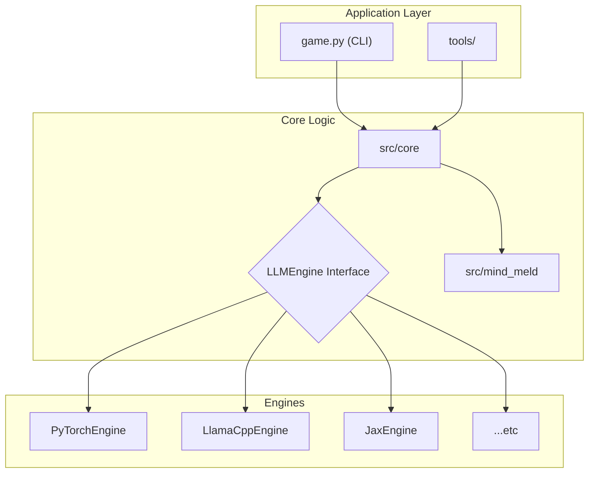

# GAMMA

- **G**ame **A**nalyzing **M**odel **M**ethods **A**ttentively

- **G**uessing **A**lternative **M**odel **M**echanics **A**nalytically

- **G**rasping **A**ttention **M**echanism **M**ysteries **A**ccessibly

## Overview

Gamma is a hands-on tool that lets you peer inside open source language models to see how they thinks and predicts text. By turning complex AI concepts into a guessing game, Gamma makes advanced machine learning techniques accessible and fun to explore. You compete against the model, trying to predict its next token choices while visualizing its internal state.


## Architecture

Gamma uses a modular architecture with a pluggable engine system, allowing the core application to run models from a variety of machine learning frameworks. This makes it easy to compare different models and to extend the tool to support new backends. [Learn more about the engine framework...](./src/engines/README.md)




## Setup

```bash
# Create and activate a virtual environment (recommended)
python -m venv venv
source venv/bin/activate

# Install base requirements
pip install -r requirements.txt

# Install PyTorch engine requirements (recommended for default models)
pip install -r requirements-pytorch.txt

# Optional: Install requirements for other engines
# pip install -r requirements-llamacpp.txt
# pip install -r requirements-mlx.txt
```

## Quick Start & Common Usage

Run the main program without any arguments to get an interactive configuration menu.

```bash
# Run the interactive LLM guessing game with default settings
python game.py
```

Or, use command-line flags for direct access to different modes:

```bash
# Start a simple, direct chat session with the default model
python game.py --chat

# Get a single response for a given prompt and see performance stats
python game.py --prompt "The first person on Mars was"

# Run the interactive tutorial to learn about LLMs
python game.py --tutorial

# Compare two models side-by-side
python game.py --comparison --comparison-models pytorch:Qwen/Qwen2-1.5B-Instruct:featherless-ai pytorch:google/gemma-2-2b-it
```

Use `python game.py --help` for a full list of all options.

## Game Modes

- **Classic Game Mode**: The original GAMMA experience where you predict what the model will generate next.
- **Chat Mode**: A simple, direct, and interactive chat session with the loaded model.
- **Single-Shot Inference**: Provide a prompt on the command line, get a single response, and see detailed performance metrics.
- **Tutorial Mode**: An interactive learning experience that teaches you how LLMs work through guided lessons.
- **Model Comparison Mode**: Compare predictions from multiple models side-by-side to understand their different behaviors.

## EXPERIMENTAL

- **Mind Meld Mode**: Allows multiple language models to collaborate during a single text generation session by dynamically swapping their neural states. [Learn more...](./src/mind_meld/README.md)

## Tools

### Model Downloader

A script is provided to download GGUF and other models from the Hugging Face Hub.

```bash
python tools/download_model.py --repo-id <REPO_ID> --filename <FILENAME>
```

### API Server

A simple FastAPI server is included to expose any loaded model via a REST API.

```bash
python tools/run_api_server.py --model <MODEL_FILENAME> [OPTIONS]
```
