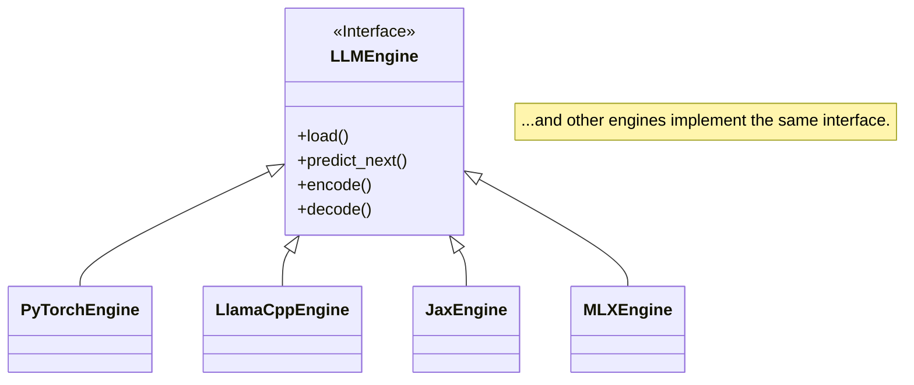

# Engine Framework

GAMMA uses a modular engine architecture that allows the core game logic to interact with models running on different machine learning frameworks. This makes the tool highly extensible and allows users to select the backend that best suits their hardware and the models they wish to explore.

Each engine is an implementation of the `LLMEngine` interface defined in `src/core/engine_interface.py`.



## Usage

You can select which engine to use with the `--engine` command-line flag. Each engine may have its own specific options.

**Example:** Running the game with the `Llama.cpp` engine.
```bash
python gamma.py game --engine llamacpp --model "path/to/your/model.gguf"
```

## Supported Frameworks

### Production Ready

These engines are fully tested and recommended for use:

| Engine | File | Status | Best For |
|--------|------|--------|----------|
| **PyTorch** | `pytorch_engine.py` | Stable | HuggingFace models, CUDA/MPS acceleration |
| **MLX** | `mlx_engine.py` | Stable | Apple Silicon Macs (fastest option) |
| **LlamaCpp** | `llama_cpp_engine.py` | Stable | GGUF quantized models, low memory usage |
| **Ollama** | `wrappers/ollama_wrapper.py` | Stable | Easy setup with Ollama service |
| **HuggingFace Inference** | `wrappers/huggingface_inference_wrapper.py` | Stable | HF Inference API (cloud) |
| **OpenAI** | `wrappers/openai_wrapper.py` | Stable | OpenAI-compatible APIs |

### Experimental

These engines are implemented but may have limitations:

| Engine | File | Status | Notes |
|--------|------|--------|-------|
| **JAX/Flax** | `jax_engine.py` | Experimental | JIT tracing issues with boolean params |
| **TensorFlow** | `tensorflow_engine.py` | Experimental | Limited model support in Flax ecosystem |
| **ONNX Runtime** | `onnx_engine.py` | Experimental | Requires ONNX-exported models |
| **vLLM** | `vllm_engine.py` | Experimental | Requires NVIDIA GPU |

### Engine Details

- **PyTorch** (`pytorch_engine.py`): The default and most feature-rich engine. Supports MPS (Apple Silicon), CUDA (NVIDIA), and CPU. Recommended for HuggingFace models.

- **MLX** (`mlx_engine.py`): Optimized for Apple Silicon using the MLX framework. Provides ~2x speedup over PyTorch MPS. Requires MLX-format models (e.g., from `mlx-community`).

- **LlamaCpp** (`llama_cpp_engine.py`): Runs GGUF-format quantized models. Supports Metal (Mac), CUDA, and CPU. Great for memory-constrained systems.

- **Ollama** (`wrappers/ollama_wrapper.py`): Wraps the Ollama service for easy model management. Auto-detects installed models.

- **HuggingFace Inference** (`wrappers/huggingface_inference_wrapper.py`): Uses HuggingFace's cloud Inference API. Requires `HF_TOKEN` environment variable.

- **OpenAI** (`wrappers/openai_wrapper.py`): Works with OpenAI API and compatible servers (LocalAI, vLLM, etc.). Set `OPENAI_API_KEY` and optionally `OPENAI_BASE_URL`.

- **JAX** (`jax_engine.py`): For Flax models. Currently has JIT compilation issues with dynamic boolean parameters. Works with GPT-2, Gemma, Llama architectures.

- **TensorFlow** (`tensorflow_engine.py`): For TF/Keras models. Limited LLM model availability.

- **ONNX Runtime** (`onnx_engine.py`): For ONNX-format models. Can leverage CoreML, CUDA, or DirectML.

- **vLLM** (`vllm_engine.py`): High-throughput serving engine. Requires NVIDIA GPU with CUDA.

### Benchmark Comparison (Apple M-series)

```
Engine      Model                    Tokens/sec    Latency p50
---------------------------------------------------------------
MLX         gemma-2-2b-it-4bit       10.8 tok/s    92ms
PyTorch     phi-2 (2.7B)              5.8 tok/s   146ms
LlamaCpp    qwen2-0.5b-q4             4.4 tok/s   174ms
```

### Installation

Each engine has its own requirements file:

```bash
# Core (always install first)
pip install -r requirements.txt           # Base dependencies

# Native Engines
pip install -r requirements-pytorch.txt   # PyTorch + transformers
pip install -r requirements-mlx.txt       # MLX (Apple Silicon)
pip install -r requirements-llamacpp.txt  # llama-cpp-python
pip install -r requirements-jax.txt       # JAX/Flax
pip install -r requirements-onnx.txt      # ONNX Runtime
pip install -r requirements-tensorflow.txt # TensorFlow
pip install -r requirements-vllm.txt      # vLLM (NVIDIA only)

# GPU-specific
pip install -r requirements-cuda.txt      # NVIDIA CUDA support
pip install -r requirements-rocm.txt      # AMD ROCm support
```