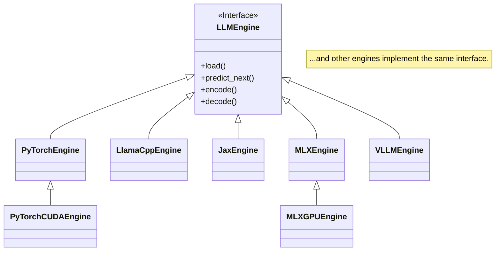

# Engine Framework

GAMMA uses a modular engine architecture that allows the core game logic to interact with models running on different machine learning frameworks. This makes the tool highly extensible and allows users to select the backend that best suits their hardware and the models they wish to explore.

Each engine is an implementation of the `LLMEngine` interface defined in `src/core/engine_interface.py`.



## Usage

You can select which engine to use with the `--engine` command-line flag. Each engine may have its own specific options.

**Example:** Running the game with the `Llama.cpp` engine.
```bash
python gamma.py game --engine llamacpp --model "path/to/your/model.gguf"
```

## Supported Frameworks

### Production Ready

These engines are fully tested and recommended for use:

| Engine | File | Status | Best For |
|--------|------|--------|----------|
| **PyTorch** | `native/pytorch_engine.py` | Stable | HuggingFace models, MPS/CPU |
| **PyTorchCUDA** | `native/pytorch_cuda_engine.py` | Stable | NVIDIA GPUs with Flash Attention, CUDA graphs |
| **MLX** | `native/mlx_engine.py` | Stable | Apple Silicon Macs |
| **MLX GPU** | `native/mlx_gpu_engine.py` | Stable | Apple Silicon with Neural Accelerators (M5+) |
| **LlamaCpp** | `native/llama_cpp_engine.py` | Stable | GGUF quantized models, low memory usage |
| **vLLM** | `native/vllm_engine.py` | Stable | High-throughput NVIDIA GPU serving |
| **Ollama** | `wrappers/ollama_wrapper.py` | Stable | Easy setup with Ollama service |
| **HuggingFace Inference** | `wrappers/huggingface_inference_wrapper.py` | Stable | HF Inference API (cloud) |
| **OpenAI** | `wrappers/openai_wrapper.py` | Stable | OpenAI-compatible APIs |

### Experimental

These engines are implemented but may have limitations:

| Engine | File | Status | Notes |
|--------|------|--------|-------|
| **JAX/Flax** | `native/jax_engine.py` | Experimental | JIT tracing issues with boolean params |
| **TensorFlow** | `native/tensorflow_engine.py` | Experimental | Limited model support |
| **ONNX Runtime** | `native/onnx_engine.py` | Experimental | Requires ONNX-exported models |

### Engine Details

#### Native Engines

- **PyTorch** (`native/pytorch_engine.py`): The default and most feature-rich engine. Supports MPS (Apple Silicon) and CPU. Recommended for HuggingFace models. Supports 4-bit/8-bit quantization via bitsandbytes.

- **PyTorchCUDA** (`native/pytorch_cuda_engine.py`): Optimized for NVIDIA GPUs with advanced CUDA features including TF32 tensor cores, Flash Attention 2, CUDA graphs (experimental), multi-GPU tensor parallelism, and torch.compile() optimization.

- **MLX** (`native/mlx_engine.py`): Optimized for Apple Silicon using the [MLX framework](https://github.com/ml-explore/mlx). Provides ~2x speedup over PyTorch MPS. Requires MLX-format models (e.g., from `mlx-community`).

- **MLX GPU** (`native/mlx_gpu_engine.py`): Enhanced MLX engine with Neural Accelerator support for M5+ chips, quantized KV cache, Metal device optimizations, and prefill optimization. Up to 4x faster than M4 for certain workloads.

- **LlamaCpp** (`native/llama_cpp_engine.py`): Runs GGUF-format quantized models via [llama.cpp](https://github.com/ggml-org/llama.cpp). Supports Metal (Mac), CUDA, Vulkan, and CPU (depending on build flags). Great for memory-constrained systems. Supports Q2-Q8 quantization levels.

- **vLLM** (`native/vllm_engine.py`): High-throughput serving engine using [vLLM](https://docs.vllm.ai/). Features PagedAttention for efficient memory, continuous batching, tensor parallelism, and speculative decoding. Requires NVIDIA GPU with CUDA (no macOS/MPS support; ROCm not supported in GAMMA’s vLLM backend). Logits are reconstructed from vLLM logprobs, so the full distribution is approximate.

#### Wrapper Engines

- **Ollama** (`wrappers/ollama_wrapper.py`): Wraps the Ollama service for easy model management. Auto-detects installed models. Note: Does not expose raw logits via HTTP API, so not suitable for Mind Meld or probability visualization.

- **HuggingFace Inference** (`wrappers/huggingface_inference_wrapper.py`): Uses HuggingFace's cloud Inference API. Requires `HF_TOKEN` environment variable.

- **OpenAI** (`wrappers/openai_wrapper.py`): Works with OpenAI API and compatible servers (LocalAI, vLLM, etc.). Set `OPENAI_API_KEY` and optionally `OPENAI_BASE_URL`.

#### Experimental Engines

- **JAX** (`native/jax_engine.py`): For Flax models. Currently has JIT compilation issues with dynamic boolean parameters. Works with GPT-2, Gemma, Llama architectures.

- **TensorFlow** (`native/tensorflow_engine.py`): For TF/Keras models. Limited LLM model availability.

- **ONNX Runtime** (`native/onnx_engine.py`): For ONNX-format models. Can leverage CoreML, CUDA, or DirectML.

### Utility Engines

| Engine | File | Purpose |
|--------|------|---------|
| **Classification** | `classification_engine.py` | Sequence classification for routing mode |

The `SequenceClassificationEngine` is used by Mind Meld's MoE Router to classify prompts and route them to specialized models.

### Engine Capability System

The `capability_registry.py` provides centralized metadata about engine capabilities:

- **Logits access** - Can return raw logit distributions
- **Attention visualization** - Can return attention weights
- **KV cache bridging** - Compatible with Mind Meld state transfer
- **Streaming support** - Supports token-by-token generation

Used by the engine factory for auto-selection and Mind Meld compatibility checks.

### Mind Meld Compatibility

For Mind Meld multi-model collaboration, engines must support raw logits access:

| Engine | Mind Meld Compatible | Notes |
|--------|---------------------|-------|
| PyTorch | Yes | Full support |
| PyTorchCUDA | Yes | Full support |
| MLX | Yes | Full support |
| MLX GPU | Yes | Full support |
| LlamaCpp | Yes | Full support |
| vLLM | Yes | Full support |
| Ollama | No | No logits via HTTP API |
| OpenAI | No | No logits via API |
| HuggingFace Inference | No | No logits via API |

Note: wrapper engines do not expose logits, so the CLI game, comparison, and
mind-meld modes require native engines. If you are using an OpenAI-compatible
vLLM server, use the native `vllm` engine for logits access.

KV cache sharing prefers direct transfer when tokenizer type/vocab and prompt
prefixes match. When they differ, Mind Meld replays the missing suffix through
the target model to rebuild its cache. Replay aligns full-token prefixes to
avoid tokenizer boundary drift rather than copying incompatible entries.

### Platform notes

- vLLM requires an NVIDIA GPU with CUDA. It is not supported on macOS or ROCm
  in GAMMA.
- PyTorch ROCm is supported via `requirements/rocm.txt`. Prefer the `pytorch`
  engine on AMD; `pytorch_cuda` is NVIDIA-specific.
- LlamaCpp Vulkan is available on Linux when `llama-cpp-python` is rebuilt with
  `CMAKE_ARGS="-DGGML_VULKAN=ON"`.
- MLX engines are Apple Silicon only.
- LlamaCpp support depends on the build (CPU, Metal, CUDA); ROCm requires a
  custom build outside the default wheels.

### Benchmark Comparison (Apple M-series)

```
Engine      Model                    Tokens/sec    Latency p50
---------------------------------------------------------------
MLX         gemma-2-2b-it-4bit       10.8 tok/s    92ms
PyTorch     phi-2 (2.7B)              5.8 tok/s   146ms
LlamaCpp    qwen2-0.5b-q4             4.4 tok/s   174ms
```

### Installation

Each engine has its own requirements file:

```bash
# Core (always install first)
pip install -r requirements.txt           # Base dependencies

# Native Engines
pip install -r requirements/pytorch.txt   # PyTorch + transformers
pip install -r requirements/mlx.txt       # MLX (Apple Silicon)
pip install -r requirements/llamacpp.txt  # llama-cpp-python
pip install -r requirements/jax.txt       # JAX/Flax
pip install -r requirements/onnx.txt      # ONNX Runtime
pip install -r requirements/tensorflow.txt # TensorFlow
pip install -r requirements/vllm.txt      # vLLM (NVIDIA only)

# GPU-specific
pip install -r requirements/cuda.txt      # NVIDIA CUDA support
pip install -r requirements/rocm.txt      # AMD ROCm support
```

## External References

- [llama.cpp](https://github.com/ggml-org/llama.cpp) - GGUF model format and C/C++ inference
- [vLLM](https://github.com/vllm-project/vllm) - High-throughput LLM inference with PagedAttention
- [MLX](https://github.com/ml-explore/mlx) - Apple Silicon ML framework
- [HuggingFace Transformers](https://huggingface.co/docs/transformers) - PyTorch model loading
- [Ollama](https://ollama.ai) - Local LLM management

## See Also

- [Engine Architecture](../../docs/ENGINE_ARCHITECTURE.md) - Detailed architecture documentation
- [Core Module](../core/README.md) - Engine interface definitions
- [Benchmarking Guide](../../docs/BENCHMARKING.md) - Performance testing
