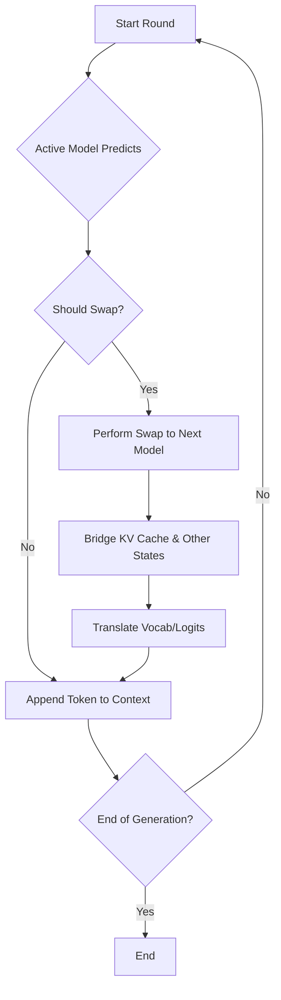

# Mind Meld Mode (EXPERIMENTAL)

A revolutionary mode that allows multiple language models to collaborate during text generation by dynamically swapping their neural states mid-sentence. This creates a unique "mind meld" effect where models can combine their strengths and produce outputs that neither could generate alone.

### Conceptual Analogy

Imagine two expert writers collaborating on a single story:

- **Writer A** is a master of vivid, creative prose.
- **Writer B** is an expert in technical accuracy and logical consistency.

Mind Meld acts as a manager, letting Writer A start a sentence with a creative flourish. Then, just before a technical detail is needed, the manager swaps them out for Writer B. The manager's crucial job is to transfer the context—the plot, character motivations, and recent sentences (the "KV Cache")—so that Writer B can seamlessly continue without missing a beat. The result is a story that is both imaginative and precise, something neither writer could have achieved as effectively on their own.

#### Quick Start

```bash
# Standalone CLI with interactive menu
python tools/run_mind_meld_cli.py

# Quick start with default Gemma models
python tools/run_mind_meld_cli.py --enhanced --blend

# Run from main game
# (Select Mind Meld from the interactive menu)
python game.py
```

#### How Mind Meld Works

**Core Concept:** Mind Meld enables real-time collaboration between multiple LLMs by:
1. **Token-Level Swapping:** Models take turns generating tokens based on configurable strategies
2. **State Transfer:** Attempts to bridge internal states (KV cache) between models for context preservation
3. **Vocabulary Alignment:** Translates probability distributions between different tokenizer vocabularies
4. **Optional Blending:** Instead of hard swapping, can blend outputs from multiple models smoothly



#### Swap Strategies

- **Pattern-Based:** Swap at punctuation marks (., !, ?, etc.)
- **Fixed Interval:** Swap every N tokens
- **Round Robin:** Swap every single token
- **Confidence-Based:** Swap when model confidence drops below threshold
- **Random:** Swap with configurable probability (30% default)
- **Attention-Guided:** Swap based on attention patterns

#### Enhanced Features (NEW)

Enable advanced capabilities with `--enhanced` flag:

##### 1. Vocabulary Alignment Strategies
- **Hybrid:** Combines multiple alignment methods for best results
- **Intersection:** Only use tokens common to all models
- **Fuzzy:** Approximate matching for similar tokens
- **Subword:** Break tokens into smaller units for alignment
- **Semantic:** Meaning-based token matching

##### 2. Ensemble/Blending Methods
Instead of hard swapping, blend model outputs smoothly:
- **Weighted Average:** Smooth probability blending from all models
- **ABE (Agreement-Based Ensembling):** Models must agree on token choices - finds tokens where one model's prediction is a prefix of another's
- **Confidence Weighted:** Trust confident models more (entropy-based)
- **Vocabulary Translation:** Maps tokens between different vocabularies
- **None:** Traditional turn-taking without blending

##### 3. Statistics Tracking
- Real-time contribution percentages
- Swap pattern analysis
- Confidence and perplexity tracking
- Export to JSON for analysis

##### 4. KV Cache Projection
Advanced bridging for incompatible model architectures:
- Projection matrices for dimension matching
- Attention head alignment
- Layer count adaptation
- Pattern preservation

#### Examples

```bash
# Basic Mind Meld with pattern-based swapping
python tools/run_mind_meld_cli.py --models pytorch:google/gemma-2b pytorch:google/gemma-2b-it --strategy pattern

# Agreement-Based Ensembling (ABE) - models must agree on tokens
python tools/run_mind_meld_cli.py --enhanced --use-abe

# Weighted averaging - blend all model probabilities
python tools/run_mind_meld_cli.py --enhanced --use-weighted-average

# Enhanced mode with confidence-weighted blending
python tools/run_mind_meld_cli.py --enhanced --blend --blend-strategy confidence_weighted

# Fixed interval swapping every 3 tokens
python tools/run_mind_meld_cli.py --strategy fixed --interval 3

# Round-robin (alternating every token)
python tools/run_mind_meld_cli.py --strategy round_robin

# Track statistics and save to file
python tools/run_mind_meld_cli.py --enhanced --stats-file meld_stats.json

# Custom vocabulary alignment
python tools/run_mind_meld_cli.py --enhanced --alignment semantic

# Optimal configuration for coherence (Pattern + ABE)
python tools/run_mind_meld_cli.py --strategy pattern --use-abe

# Optimal configuration for diversity (Round-robin + Weighted Avg)
python tools/run_mind_meld_cli.py --strategy round_robin --use-weighted-average
```

#### Configuration Options

| Option | Description | Default |
|--------|-------------|---------|
| `--enhanced` | Enable advanced features | False |
| `--blend` | Use logit blending instead of swapping | False |
| `--use-abe` | Enable Agreement-Based Ensembling | False |
| `--use-weighted-average` | Enable weighted averaging of all models | False |
| `--strategy` | Swap strategy (pattern/fixed/round_robin/etc) | pattern |
| `--interval` | Tokens between swaps (fixed strategy) | 5 |
| `--blend-strategy` | How to blend logits | weighted_average |
| `--alignment` | Vocabulary alignment method | hybrid |
| `--stats-file` | Save statistics to JSON | None |
| `--temperature` | Generation temperature | 0.7 |
| `--top-k` | Top-K filtering | 8 |
| `--top-p` | Top-P (nucleus) filtering | 0.95 |

#### Technical Details

**Architecture Components:**
- `MeldEngine`: Orchestrates model swapping and state management
- `VocabularyAligner`: Handles token vocabulary differences
- `LogitBlender`: Implements smooth output blending
- `KVCacheProjectionBridge`: Bridges incompatible model architectures
- `StatisticsTracker`: Monitors model contributions and performance

**Challenges Addressed:**
- **Vocabulary Mismatch:** Different models use different tokenizers
- **Architecture Incompatibility:** Models have different dimensions/layers
- **Context Preservation:** Maintaining coherent state across swaps
- **Smooth Transitions:** Avoiding jarring changes in output style

#### Configuration Compatibility Matrix

##### Optimal Configurations

1. **For Maximum Coherence:**
   - Swap Strategy: Pattern-based
   - Ensemble Method: ABE
   - KV Cache: Reset
   - *Models agree on natural sentence boundaries*

2. **For Maximum Diversity:**
   - Swap Strategy: Round-robin
   - Ensemble Method: Weighted averaging
   - KV Cache: Reset
   - *Every token benefits from all models*

3. **For Speed:**
   - Swap Strategy: Fixed interval (10-20 tokens)
   - Ensemble Method: None
   - KV Cache: Direct transfer (if compatible)
   - *Fewer swaps, potential cache reuse*

4. **For Accuracy (with ABE):**
   - Swap Strategy: None (ABE handles all tokens)
   - Ensemble Method: ABE
   - KV Cache: N/A (no swapping)
   - *All models contribute to every token with agreement requirement*

##### Full Compatibility Details

**✅ Fully Compatible Combinations:**
- Pattern-based + Any ensemble method + Any KV strategy
- Fixed interval + Weighted averaging + Reset cache
- Round-robin + ABE + Reset cache (maximum agreement checking)
- Confidence-based + ABE + Reset (swaps when uncertain, ABE helps resolve)

**⚠️ Partially Compatible:**
- Round-robin + Direct KV transfer (too frequent for cache efficiency)
- Any swap + Direct transfer with Gemma models (HybridCache objects not fully supported)
- Weighted averaging + Vocabulary translation (redundant, choose one)

**❌ Not Recommended:**
- Attention-guided + ABE (both need attention, may conflict)
- Round-robin + Direct KV transfer (cache thrashing)
- High-frequency swapping + Complex blending (performance issues)

##### Total Configuration Space
- 6 swap strategies × 4 ensemble methods × 3 KV cache strategies = **72 possible combinations**
- Practically useful: ~20 combinations
- Recommended: 4-6 optimal configurations listed above

#### Limitations

- KV cache bridging rarely works with current Gemma models (use HybridCache objects)
- Some model combinations may reset context on swap
- Vocabulary alignment can introduce slight probability shifts
- Performance overhead from running multiple models
- ABE works best without swapping (handles all models simultaneously)
- Pattern-based swapping is most natural for reading flow

#### Agreement-Based Ensembling (ABE) Details

ABE is an inference-time algorithm that combines predictions from multiple LLMs by finding token combinations where the resulting text strings "agree" (one is a prefix of the other). 

**How ABE Works:**
1. At each step, every model proposes a probability distribution over its vocabulary
2. ABE searches across models' top-k tokens to find combinations that agree
3. Agreement means one token's text is a prefix of another's (e.g., "the" and "then")
4. The highest-scoring agreed-upon combination is selected
5. If one model generates a longer token, others are "stalled" until they catch up

**Benefits:**
- Reduces hallucinations by requiring consensus
- Improves accuracy especially in translation tasks
- Works across different vocabularies
- No training required - pure inference-time technique

**Best Use Cases for ABE:**
- Tasks requiring high precision (translation, factual generation)
- Reducing model hallucinations
- Combining models with different strengths
- When coherence is more important than diversity

#### Use Cases

- **Creative Writing:** Combine creative and analytical models
- **Style Transfer:** Blend formal and casual language models  
- **Capability Fusion:** Merge specialized models (code + prose)
- **Model Comparison:** See how different models approach the same context
- **Research:** Study model behavior and interaction patterns
- **High-Precision Tasks:** Use ABE for translation or factual generation
- **Hallucination Reduction:** ABE's agreement requirement filters out divergent predictions

#### References & Further Reading

- **Agreement-Based Ensembling (ABE)**: [Improving Multi-Model Inference via Agreement-Based Ensemble](https://arxiv.org/html/2502.21265v1)
  - Original paper describing the ABE algorithm for combining predictions from multiple LLMs
  - Shows how requiring agreement between models reduces hallucinations and improves accuracy
  - Demonstrates effectiveness particularly in translation tasks